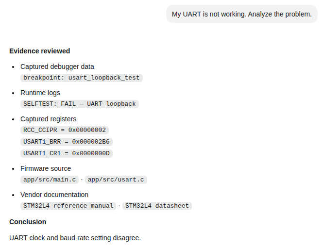

# DebugOracle

DebugOracle is a command-line (CLI) tool used by a coding agent to investigate embedded bugs using real evidence from your project, debugger, runtime logs, and manufacturer documentation.

It provides debugger data, runtime logs, peripheral registers, and vendor documentation to the workspace agent to significantly improve its reasoning basis.



## What it can do

- Read captured debugger state: stop reason, call stack, registers, and local variables.
- Compare optional RTT logs with firmware source and captured hardware state.
- Decode peripheral registers safely and read-only with a matching SVD file.
- Search local reference manuals and datasheets with page-level references.
- Report the evidence used, what remains unknown, and the next useful action.

DebugOracle is operated through its CLI by a coding agent such as Codex or Claude Code. You do not need to learn its commands to get started.

## What you need

| For | You need |
| --- | --- |
| Install DebugOracle | Linux, current macOS, or current Windows PowerShell; Python 3.12.x only; `pipx`; and Codex or Claude Code |
| Capture debug evidence | Your firmware project, a built ELF, and your existing debugger setup—normally Cortex-Debug and OpenOCD |
| **Full hardware debugging** | A matching SVD plus the device reference manual and/or datasheet as PDFs |

## Get started

1. Clone this repository, then open the folder in Codex or Claude Code:

```text
Install DebugOracle for this user with the supported installer. Read the project instructions and README first. Explain optional components before installing them, make only routine per-user changes, and confirm that `dbgoracle --version` works.
```

2. **In your firmware project**, open an agent session and ask:

```text
Set up DebugOracle for this project. Discover the available inputs, configure everything that is safe and unambiguous, and explain clearly what is missing. Ask me before preparing manuals or datasheets for search. Do not overwrite my existing project configuration without showing me the required change.
```

> The supported installer is available on Linux, current macOS, and current Windows PowerShell. It installs DebugOracle, not OpenOCD, VS Code, Cortex-Debug, drivers, or board-specific tooling.

## Add files to supercharge your debugging

Use the optional `debugoracle-input/` folder for any helpful project files:

- Reference manuals or datasheets (`.pdf`)
- A matching peripheral description (`.svd`)
- A built firmware image (`.elf`)
- Existing debugger configuration
- Captured logs

```text
debugoracle-input/
├── documentation/
├── device.svd
├── firmware.elf
├── debugger-config/
└── captured-logs/
```

The folder is not required. Everything in it is optional, and filenames and subfolders do not matter. DebugOracle also checks common project locations such as `docs/`, `.dbgoracle/`, existing VS Code configuration, and known build-output locations.

<details>
<summary>How document search works</summary>

If PDFs are found, the agent asks permission before preparing them for local search. It may take seconds to several minutes. The tool searches only local PDFs; it does not download vendor documentation. Original files stay unchanged; generated search data is stored under `.dbgoracle/documentation-search/`.

Parser choice affects result quality. The supported 0.3.1 install uses the
default `pypdf` parser, which extracts text page by page. Scanned or image-only
pages are incomplete, encrypted or malformed PDFs cannot be ingested, and
complex tables or layouts may extract less accurately. The optional Docling
and semantic profiles remain disabled until their dependency and model license
audits are complete.
</details>

## What DebugOracle changes

| DebugOracle may create | DebugOracle does not |
| --- | --- |
| `.dbgoracle/` and `debugoracle-input/` | Modify firmware or supplied files |
| DebugOracle-owned VS Code setup files | Flash or control the target |
| Narrow `.gitignore` rules for local inputs and generated evidence | Download vendor documents or overwrite user-owned VS Code configuration |

## Platform support

DebugOracle supports Python 3.12.x only. Installer contracts run on Linux, current Apple Silicon macOS, current Intel macOS, and current Windows. Full end-to-end user installation workflows on macOS and Windows are currently unverified; the authoritative public-release environment remains Ubuntu 24.04 LTS x86-64 with Python 3.12 and `pipx`.

## Help and documentation

- [Installation](docs/guides/installation.md)
- [Workspace setup and file discovery](docs/guides/workspace-setup.md)
- [Manufacturer documentation](docs/guides/vendor-documentation.md)
- [Cortex-Debug setup](examples/cortex-debug/README.md)
- [Troubleshooting](docs/guides/troubleshooting.md)
- [Command reference](docs/specs/cli.md)
- [Architecture](docs/architecture.md)
- [Security reporting](SECURITY.md)

For ordinary bugs and setup questions, use [GitHub Issues](https://github.com/nikolasvoss/debugOracle/issues).
