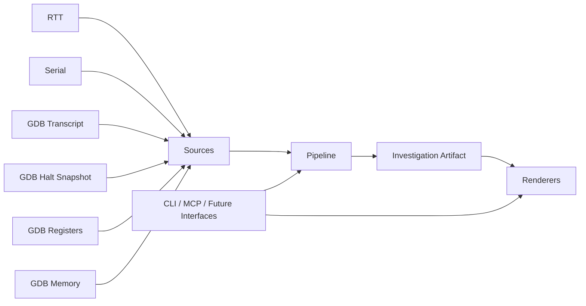
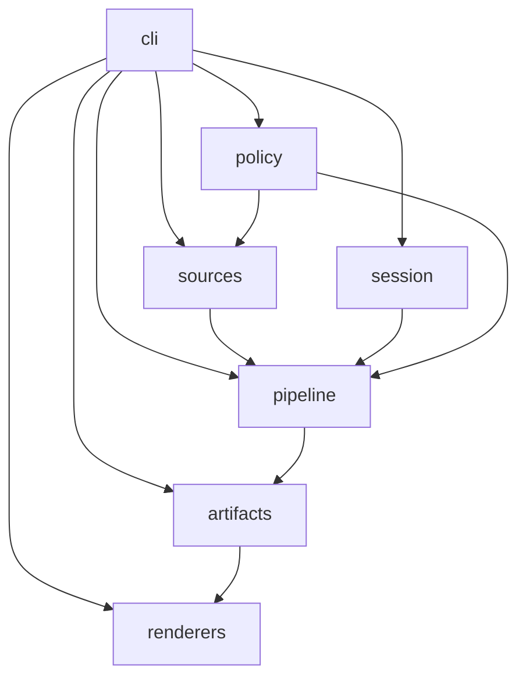
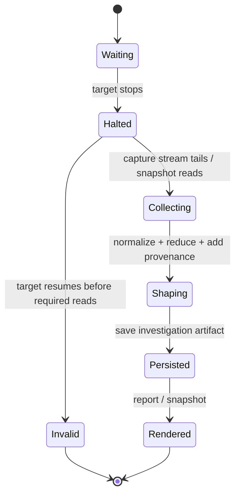

# DebugOracle Architecture

Status: Active — current architectural source of truth.

Use the [architecture review framework](plans/DebugOracle%20%E2%80%93%20Architecture%20Review%20and%20Incremental%20Evolution%20Plan.md)
to evaluate prospective changes and the [ADR template](plans/DebugOracle%20%E2%80%93%20Architecture%20Decision%20Record%20Template.md)
to record decisions. Neither supersedes this document.

This document defines the target architecture for DebugOracle as the product expands beyond the current early implementation.

It is intentionally product-shaped rather than code-shaped. Maintainers and agents should use this file to understand the intended system boundaries before inspecting module-level specs or implementation files.

## Purpose

DebugOracle is a read-only embedded debug evidence system.

Its job is to:

- collect evidence from pluggable debug sources
- normalize and reduce that evidence into a canonical investigation artifact
- preserve provenance so humans and agents can trust what they see
- expose concise default views while allowing richer read-only follow-up requests

Its job is not to:

- control the debugger as a general automation brain
- write to the device under test
- hide uncertainty about when or how data was gathered

## Architectural Invariants

- Sources are the primary functional entry points.
- Source families are explicit in both code and docs.
- The two source families are `stream` and `snapshot`.
- All current analysis is halt-centric.
- DebugOracle should assume analysis is valid only while the target is halted.
- Registers and memory are treated as stable only during halted analysis.
- Data collected while the target is running must be rejected, downgraded, or explicitly labeled as unsafe for correlation.
- Requested reads are canonical for now so tool development has a durable investigation record.
- The middle of the system owns normalization, reduction, provenance, and storage shaping.
- Rendering is outside the core and should remain intentionally dumb.
- Full cross-source correlation is deferred for now.
- The preferred anchor is a halt event, but the system may still carry session-level timing metadata.

## Functional Model

DebugOracle has five functional layers:

1. Source acquisition
   Read-only collection from sources such as RTT, serial, GDB transcript, registers, and memory.
2. Middle pipeline
   Selective parsing, normalization, reduction, provenance, and storage shaping.
3. Investigation artifact persistence
   Canonical storage of the shaped evidence for reuse, rendering, and later agent requests.
4. Rendering surfaces
   Human and agent outputs such as status, report, and other read-only inspection views.
5. Entry surfaces
   CLI today, with agent-mediated CLI workflows as the near-term operating model; MCP and other agent-facing interfaces later.

## Source Families

### Stream sources

Stream sources represent flowing or transcript-like evidence.

Examples:

- RTT
- serial
- GDB transcript

Expected characteristics:

- potentially noisy
- ordered over time
- often high volume
- may need selective parsing and aggressive reduction

### Snapshot sources

Snapshot sources represent point-in-time evidence taken during a halt.

Examples:

- GDB halt snapshot
- GDB-backed registers
- GDB-backed memory

Expected characteristics:

- compact and structured
- tied to a halt when valid
- lower volume than streams
- better suited for canonical artifact fields

## Source Contract

Every source implementation must declare its identity and collection semantics explicitly in code.

Required metadata:

- `source_id`
- `family`: `stream` or `snapshot`
- `trigger`: for example `passive`, `on_halt`, or `agent_request`
- `requires_halt`
- `persistence_default`
- `backend_dependency`
- `supports_parsing`
- `supports_reduction`

This metadata is not decorative. It is the basis for:

- policy enforcement
- consistent user messaging
- MCP and CLI capability exposure
- architecture-level tests

## Halt-Centric Analysis

Halted analysis is a product constraint, not an incidental implementation detail.

The system should make the following distinction explicit:

- A halt event provides a coherent analysis slice.
- Freshness answers whether the data was actually captured from that halt and how trustworthy that assumption is.

Even with halt-centric analysis, freshness still matters because different pieces of evidence may be captured at different moments, or may come from saved artifacts rather than the current live state.

The minimum timing and trust metadata should support:

- `halt_id`
- `captured_at`
- `target_state_at_capture`
- `freshness_class`

Suggested freshness classes:

- `same_halt`
- `near_halt`
- `stale`
- `unknown`

For the current product stage, anything not clearly tied to a halted analysis slice should be surfaced as lower-confidence evidence.

## Investigation Artifact

The canonical persisted unit is an investigation artifact.

Current assumption:

- one investigation artifact is centered on one meaningful halt

Future extension:

- an investigation artifact may later hold multiple halt slices or a session history

The artifact should be the system boundary for:

- provenance
- reuse across commands
- report rendering
- regression fixtures
- future MCP tool responses

## Middle Pipeline Responsibilities

The middle pipeline exists to absorb product change without forcing every source or output surface to reinvent the same logic.

It owns:

- selective parsing when raw data is noisy
- normalization into shared evidence records
- reduction to keep artifacts compact and useful
- provenance tagging
- storage shaping into the canonical investigation artifact

It does not own presentation formatting.

## Target Package Structure

This is the intended package shape as the current flat implementation evolves:

```text
debugoracle/
  cli/
    __init__.py
    main.py
    commands/
      status_capture.py
      run_stop.py
      evidence.py

  sources/
    base.py
    streams/
      rtt.py
    debuggers/
      gdb/
        transcript.py
        halt_snapshot.py
        registers.py
        memory.py

  pipeline/
    storage.py

  session.py

  artifacts/
    models.py
    bundle.py
    repository.py

  renderers/
    snapshot.py
    report.py
    status.py

  policy/
    halted_analysis.py
    read_safety.py
    limits.py
```

## Package Responsibilities

### `cli/`

- preserve the compatibility-facing `debugoracle.cli.main` entrypoint
- parse user input
- dispatch command families from `main.py` into `cli/commands/`
- orchestrate calls into the core
- avoid owning product rules

### `sources/`

- read from concrete sources
- convert raw source material into typed source records
- declare source semantics through the source contract

### `pipeline/`

- apply shared normalization and reduction rules
- attach provenance
- shape output for artifact persistence

### `session/`

- resolve workspace context
- track halt-related analysis state
- model freshness and trust around the current analysis slice

### `artifacts/`

- define the canonical persisted investigation artifact
- read and write artifact storage
- give tests and other interfaces a stable persistence boundary

### `renderers/`

- format already-shaped artifact data for users or agents
- avoid embedding collection and shaping logic

### `policy/`

- centralize halt-only rules
- centralize read-safety and output limits
- make product constraints testable and explicit

## Why GDB Has One Home

GDB should have one top-level home under `sources/debuggers/gdb/`.

This keeps the tree intuitive for maintainers while still reflecting two different data shapes:

- `transcript.py` for stream-like GDB evidence
- `halt_snapshot.py`, `registers.py`, and `memory.py` for halt-shaped snapshot evidence

This is clearer than placing GDB in two unrelated top-level folders and more honest than pretending all GDB-derived data behaves the same way.

## Testing Strategy

Testing should be split across both module-level and behavior-level seams.

### Module tests

Use focused unit tests for:

- source implementations
- pipeline stages
- artifact repository logic
- policy decisions
- renderers

These tests should keep refactors cheap and failures local.

### Behavior tests

Use broader tests for architecture rules such as:

- halted analysis requirements
- canonical persistence of requested reads
- stream reduction behavior
- provenance preservation
- CLI or MCP use cases producing the correct artifact shape

These tests should protect the product model, not just the implementation details.

## Diagrams

### System Flow



### Package Dependency Direction



### Halted Analysis Lifecycle



## Documentation Layout

Use a three-part documentation structure:

- [docs/strategy.md](strategy.md) for the product operating model and canonical story
- [docs/architecture.md](architecture.md) for the whole-system view and diagrams
- [docs/specs/README.md](specs/README.md) for code-near module specs

When implementation changes materially alter module boundaries, update this architecture document first, then update the affected module specs. When the product operating model changes, update the strategy doc first so the architecture stays aligned to the same story.

## Migration Direction

The current implementation is flatter than the target architecture. That is acceptable in the short term.

Refactoring should proceed incrementally:

1. Split CLI orchestration away from product logic.
2. Introduce explicit source contracts and metadata.
3. Move shaping logic into the middle pipeline.
4. Make the investigation artifact a clearer persistence boundary.
5. Move rendering into dedicated renderers.
6. Centralize halted-analysis and read-safety policy.

The goal is not immediate package purity. The goal is a codebase where maintainers and agents can predict where a feature belongs and where a rule is enforced.
